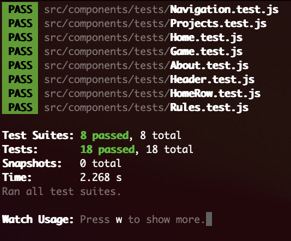

# Project 3 Option 2 - Website with Game
---

### Project Description
In this project I have created a skelton for my personal website. This website will serve as my personal portfolio and an info page about me. This website is not full of content but it includes a projects page. On the projects page there is a working game that is an example project. The website is also has some aspects of responsive design.

The project is designed with a number of react reusable components and is automatically tested.

---
#### Instructions to Play the game:

In order to play the game you must first navigate to the projects page. Once on the page you can click into the input box and put 1 character. Then you can tap [enter] or click on the Check button to see if you guessed the letter correctly. You must enter letters one at a time. If you miss 7 times you will lose. If you guess all the letters correct you win. At any time you can click the Reset button and a new word will be chosen and the game will be reset. 

---

### Evidence of Testing
